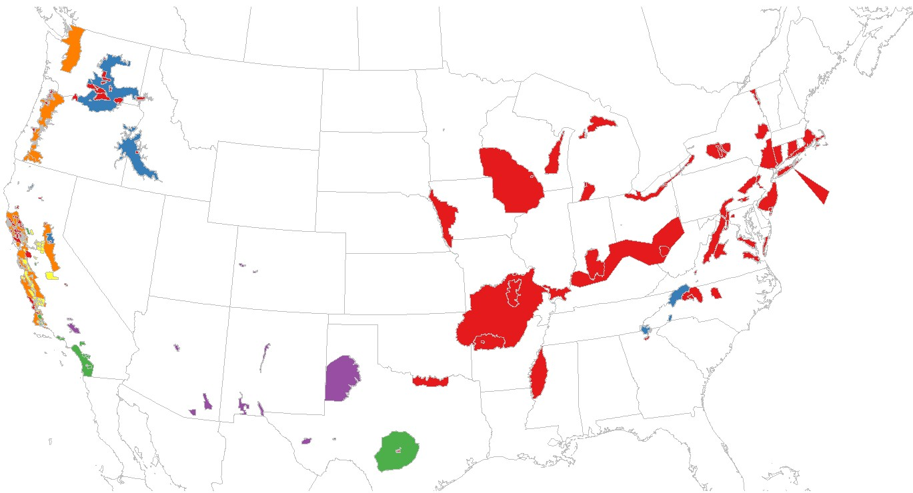
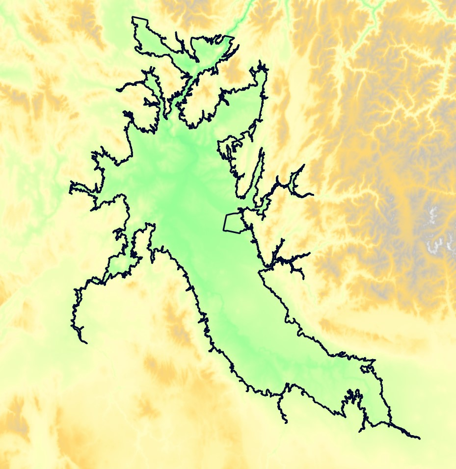
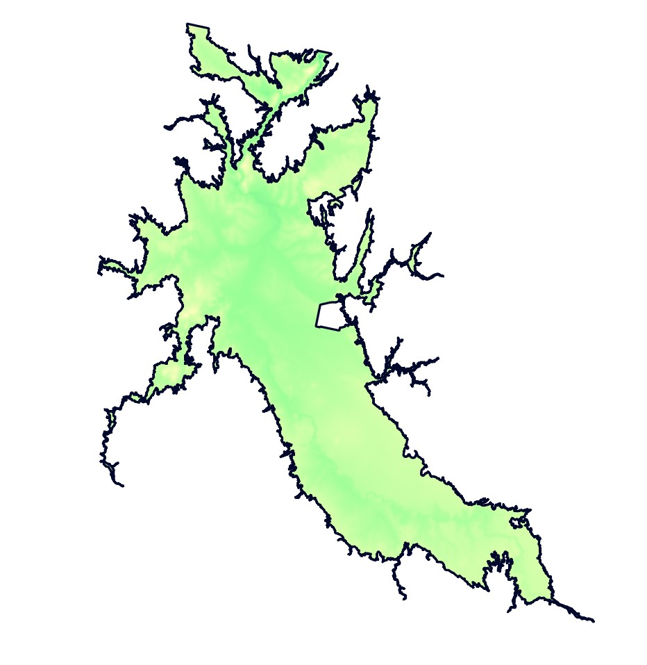

# Classifying American Viticultural Areas Based on Environmental Data

This repository contains code related to Michele Tobias' 2022 [FOSS4G Academic Track](https://2022.foss4g.org/cfp-academic_track.php) paper submission "Classifying American Viticultural Areas Based on Environmental Data".

Using the UC Davis AVA dataset alongside datasets defining environmental characteristics such as soils, climate, and elevation, we seek to understand how the characteristics present within the AVA boundaries are similar to each other using a hierarchical clustering process.  

An example of results of a cluster analysis of AVA boundaries using climate variables, using 6 clusters.

[ISPRS Publisher Guidelines](https://www.isprs.org/documents/orangebook/app5.aspx )

**Submission Deadline:** June 1, 2022

## Data Sources

### UC Davis' [AVA Digitizing Project](https://github.com/UCDavisLibrary/ava)

 * **Current AVA boundaries:** avas.geojson

### Oregon State University's [PRISM Climate Data](https://prism.oregonstate.edu/)

 * **Precipitation 30 Year Climate Normals:** PRISM_ppt_30yr_normal_800mM3_annual_bil.bil
 * **Mean Temperature 30 Year Climate Normals:** PRISM_tmean_30yr_normal_800mM3_annual_bil.bil
 * **Minimum Temperature 30 Year Climate Normals:** PRISM_tmin_30yr_normal_800mM3_annual_bil.bil
 * **Maximum Temperature 30 Year Climate Normals:** PRISM_tmax_30yr_normal_800mM3_annual_bil.bil
 * **Elevation:** PRISM_us_dem_800m_bil.bil
 
## Workflow

Snake River AVA boundary overlayed on the PRISM elevation dataset.

1. For each AVA boundary and each raster dataset:
	1. Extract the cells that intersect the boundary.
	1. Summarize the extracted data with the mean and range (lowest value subtracted from the highest value)
	

The PRISM elevation dataset clipped by the Snake River AVA boundary

2. For each attribute (column), calculate the z-score for each record: z=(value-mean)/sd
3. Calculate a dissimilarity matrix
4. Hierarchical clusters

## Example Input Data for Cluster Analysis

| ava_id | ppt_range | ppt_mean | elev_range | elev_mean | t_range | t_mean |
| --- | --- | --- | --- | --- | --- | --- |
|adelaida_district|529.3044128|570.9880|427.2993317|420.464651|18.676187|14.856683|113|
|alexander_valley|312.9765625|1058.9631|720.4053688|208.143084|14.719194|15.133910|214|
|alexandria_lakes|6.5897827|673.4908|21.7002869|427.544259|10.586075|5.492186|233|
|alisos_canyon|21.0177002|446.8349|160.3984985|293.058929|14.657202|15.484408|133|
|alta_mesa|89.2421265|486.8235|26.1987314|19.036722|14.250541|16.345103|

260 AVAs (... actualy 259 because I had to remove Hawaii's AVA since PRISM only covers the "lower 48")

## Outstanding Questions

1. Can I incorporate categorical data such as soil series name from SSURGO into this analysis? Or does hierarchical clustering require only numerical data?
1. The samples here are not geographically distinct - there is overlap among boundaries. Do I need to worry about lack of independence? Spatial autocorrelation?
1. What other datasets would be interesting/useful to include?
	- Other AVA data includes the date issued, area
	- Outside data sources?

## Document Manifest
*code* folder
  - `AVA_Clustering.R` - main analysis code for this paper

*images* folder - a folder containing images for use in the documentation readme files on this repository

`LICENSE` - license for the code

`README.md` - the main informational file for the repository

## License
This repository is [licensed](LICENSE) under the Apache 2.0 License.

